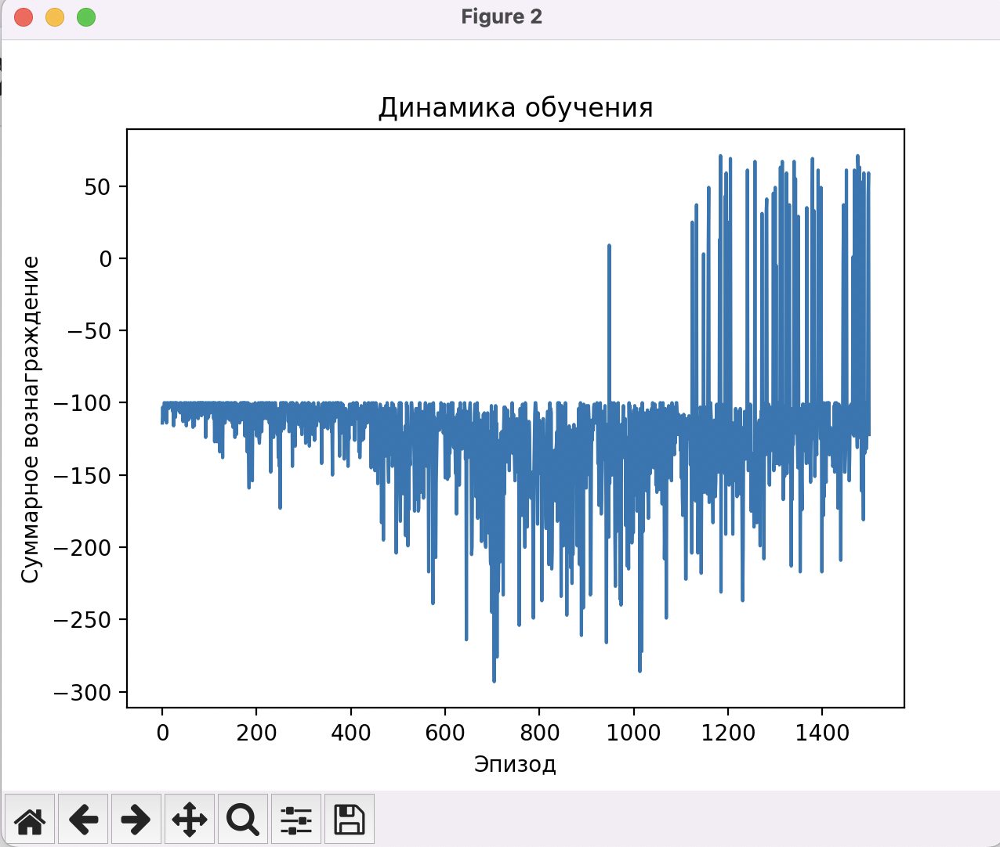
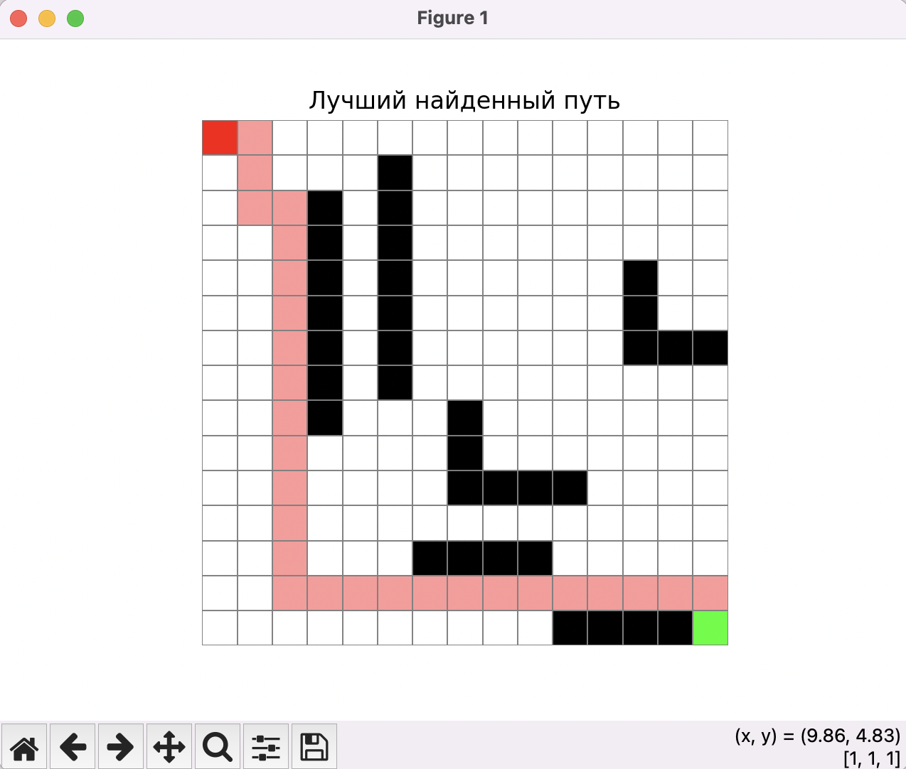

# dqn-path-planner

This project implements training a drone to find a path in a grid with obstacles using the **Deep Q-Network (DQN)** algorithm.  

## Description

- The environment is modeled as a 2D grid with limited visibility (`DroneEnv`).  
- The agent learns to find the optimal path from the start to the goal while avoiding obstacles.  
- The DQN implementation in PyTorch includes:  
  - experience replay buffer,  
  - ε-greedy strategy,  
  - separate target network with periodic updates.  
- Training progress and the final path are visualized with matplotlib.

   
